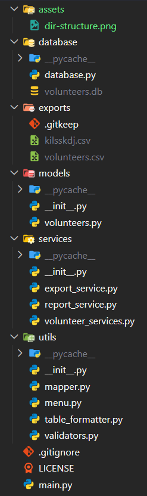

<h1 align="center">
  
</h1>

<p align="center"><i>Manage volunteers efficiently. Empower communities.</i></p>

---

Volunteer Management System is a **command-line volunteer management application built in Python**, designed to help organizations efficiently manage volunteer records through a clean, modular, and menu-driven interface powered by **SQLite**.

The project focuses on **Python fundamentals, object-oriented programming, modular software architecture, SQLite database integration, CRUD operations, input validation, data processing, reporting, CSV export, and practical CLI application development**, while using Python's standard library.

> Note: This project was developed as a submission for the Python Developer Internship Task at NayePankh Foundation, with a focus on clean architecture, modularity, database management, and practical CLI application development.

<p align="center">
  
</p>

<p align="center">
  
  
  
</p>

<p align="center">
  
</p>

<p align="center">
  
</p>

## Features

1. ### Volunteer Management (CRUD)

   * Add new volunteers
   * View all volunteers
   * Update volunteer information
   * Delete volunteer records

2. ### Search & Filtering

   * Search volunteers by name, city, or skill
   * Filter volunteers by city
   * Filter volunteers by skill
   * Filter volunteers by availability

3. ### Reports

   * Total volunteer count
   * Available and unavailable volunteer statistics
   * Volunteers grouped by city
   * Volunteers grouped by skill

4. ### CSV Export

   * Export volunteer records to CSV
   * Excel-compatible output
   * Custom filename support

5. ### User Experience

   * Interactive menu-driven interface
   * Input validation
   * Clean tabular output
   * Modular project architecture

## Project Architecture

<p align="center">
  
</p>

## Application Workflow

```text
User
   ↓
CLI Menu
   ↓
Volunteer / Report / Export Services
   ↓
SQLite Database
   ↓
Formatted Output / CSV Export
```

## Tech Stack

<div align="center">

| Component        | Technology   |
| ---------------- | ------------ |
| Language         | Python 3     |
| Database         | SQLite3      |
| CSV Export       | csv          |
| Input Validation | re           |
| Version Control  | Git + GitHub |

</div>

## Build & Run Instructions

### Requirements

* Python 3.10 or higher
* Git (for cloning the repository)

### Clone the Repository

```bash
git clone https://github.com/abhi-saurav-saroya/nayepankh-volunteer-management-system.git
cd nayepankh-volunteer-management-system
```

### Run the Application

```bash
python main.py
```

or

```bash
python3 main.py
```

### Usage

1. Launch the application.
2. Select an option from the main menu.
3. Manage volunteer records using CRUD operations.
4. Search or filter volunteers.
5. Generate volunteer reports.
6. Export volunteer data to CSV whenever required.

<p align="center">
  
</p>

<div align="center">


<i>Built to learn, designed to organize, engineered one volunteer at a time. 🤝</i>

<i>Manage volunteers efficiently. Empower communities.</i>

<p align="center">
  
</p>

**© 2026 Open Source Project | Volunteer Management System | MIT License**

</div>
